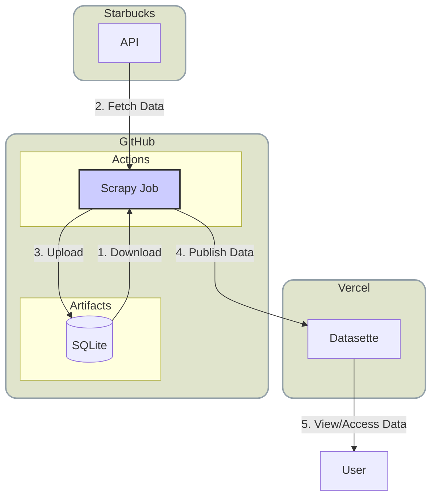
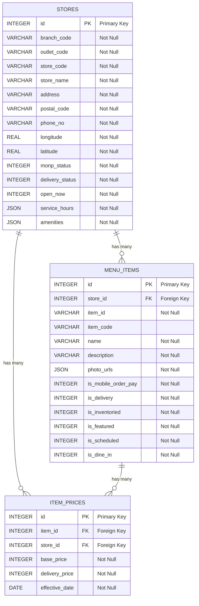

# StarbucksDB

[](https://github.com/ngshiheng/starbucksdb/actions/workflows/scrape.yml)

StarbucksDB is a data collection and storage project focused on Starbucks store and menu information. It uses web scraping techniques to gather data about Starbucks locations, menu items, and pricing, storing this information in a SQLite database for easy access and analysis.

## How It Works



## Installation

1. Clone the repository: `git clone https://github.com/ngshiheng/starbucksdb.git`
2. Install dependencies using Poetry: `poetry install --no-root`
3. Activate the virtual environment: `poetry shell`

## Usage

```sh
# To run the spider and collect data:
poetry run scrapy crawl singapore
```

## Database Schema



The project uses three main models:

1. `Store`: Represents a Starbucks store location
2. `Item`: Represents a menu item
3. `Price`: Represents the pricing information for an item at a specific store

For detailed schema information, refer to the [`database.py`](./starbucksdb/models/database.py) file.

## License

This project is licensed under the [MIT License](./LICENSE).

## Disclaimer

This software is only used for research purposes, users must abide by the relevant laws and regulations of their location, please do not use it for illegal purposes. The user shall bear all the consequences caused by illegal use.
